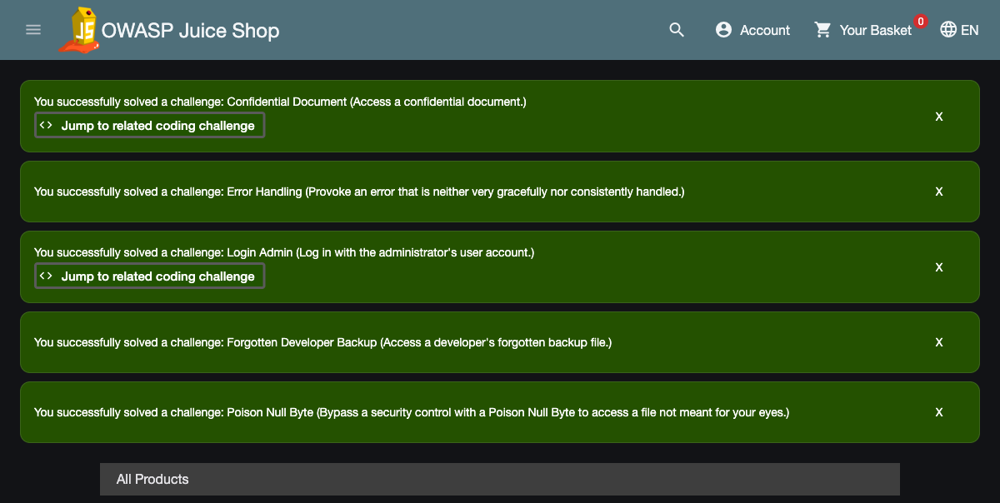
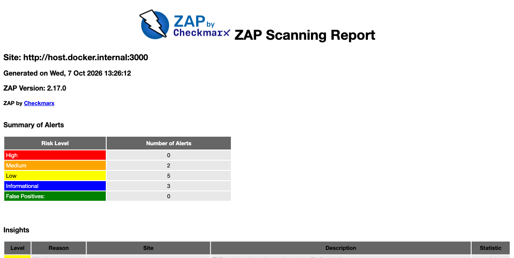
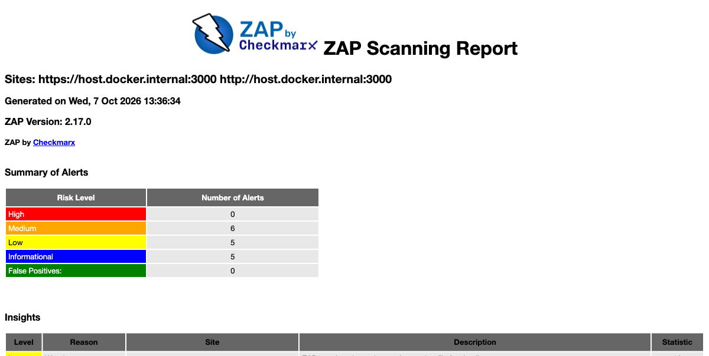
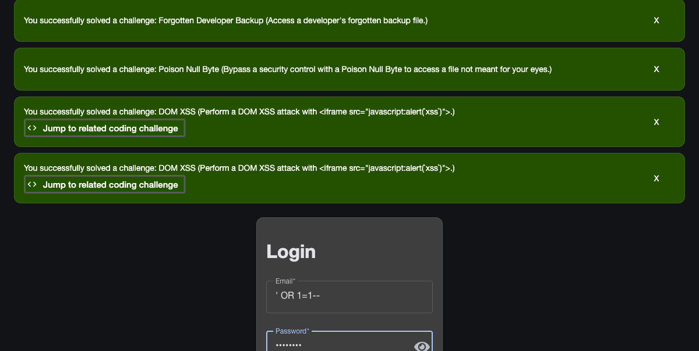
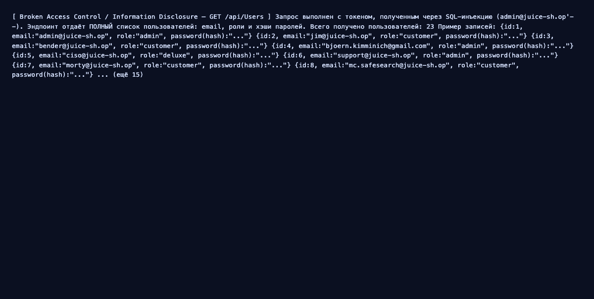
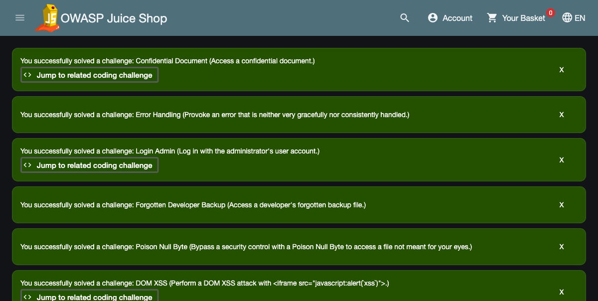
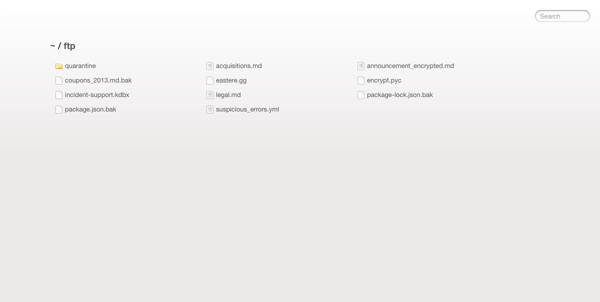
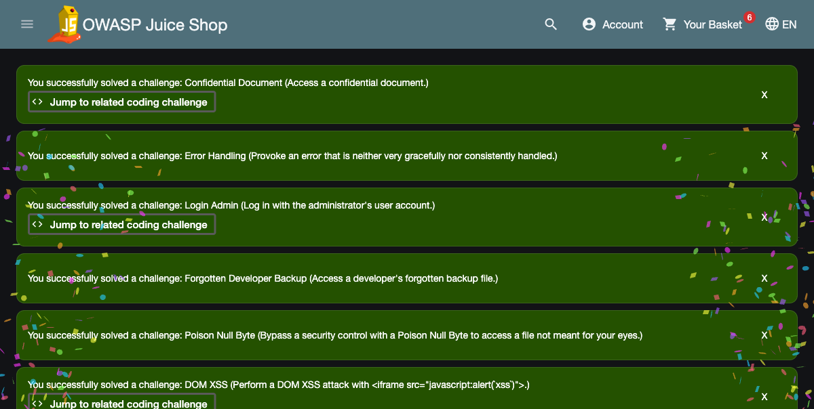

# Аудит безопасности веб-приложения OWASP Juice Shop

Учебный проект по дисциплине «Информационная безопасность», работа 3.

Комплексный аудит защищённости веб-приложения [OWASP Juice Shop](https://owasp.org/www-project-juice-shop/)
(версия 20.2.0): динамическое сканирование (DAST) с помощью **OWASP ZAP** и
проактивное моделирование угроз по методике **STRIDE** с построением диаграммы
потока данных (DFD).

## Стенд

| Компонент | Значение |
|---|---|
| Цель (SUT) | OWASP Juice Shop 20.2.0 (`bkimminich/juice-shop`) |
| Адрес цели | `http://localhost:3000` |
| DAST-сканер | OWASP ZAP (`zaproxy/zap-stable`), baseline + full (active) scan |
| Ручная верификация | `curl`, DevTools, браузер (Chromium) |
| ОС | macOS, Docker 28.0.1 |

Juice Shop и ZAP запускались в Docker, ZAP обращался к цели через
`host.docker.internal:3000`.



### Как поднять стенд

```bash
# 1. Уязвимое приложение
docker run -d --name juice-shop -p 3000:3000 bkimminich/juice-shop
# проверка: http://localhost:3000  -> HTTP 200

# 2. DAST: пассивный baseline-скан (заголовки, инфо-дисклоуз)
docker run --rm -v "$(pwd)/zap:/zap/wrk/:rw" -t zaproxy/zap-stable zap-baseline.py \
  -t http://host.docker.internal:3000 \
  -r zap-baseline-report.html -J zap-baseline-report.json -w zap-baseline-report.md -I

# 3. DAST: активный full-скан (инъекции: SQLi, XSS и т.д.)
docker run --rm -v "$(pwd)/zap:/zap/wrk/:rw" -t zaproxy/zap-stable zap-full-scan.py \
  -t http://host.docker.internal:3000 \
  -r zap-full-report.html -J zap-full-report.json -w zap-full-report.md -I
```

## Краткое резюме

Juice Shop намеренно уязвим и используется как учебный полигон. В ходе аудита
найдено и **верифицировано вручную не менее 6 уязвимостей**, в том числе
обязательные **SQL Injection** и **Cross-Site Scripting**. Automated-сканер ZAP
дополнительно подтвердил классы проблем конфигурации (отсутствие CSP, небезопасный
CORS, раскрытие данных через заголовки).

Самые опасные находки — **SQL-инъекция в форме входа** (полный обход
аутентификации, вход под администратором без пароля) и **Broken Access Control**
на `/api/Users` (выгрузка всех учётных записей с хэшами паролей). В сочетании с
**DOM-based XSS** в поиске это даёт реализуемую цепочку атаки:
кража токена через XSS → доступ к API → эскалация до администратора.

| # | Уязвимость | Риск (CVSS 3.1) | OWASP Top 10 2021 |
|---|---|---|---|
| 1 | SQL Injection (обход аутентификации в `/rest/user/login`) | 9.8 Critical | A03 Injection |
| 2 | Broken Access Control (`GET /api/Users` отдаёт всех юзеров) | 7.5 High | A01 Broken Access Control |
| 3 | DOM-based XSS в поиске (`/#/search?q=`) | 6.1 Medium | A03 Injection |
| 4 | Sensitive Data Exposure (листинг `/ftp`, `.bak`, `.kdbx`) | 7.5 High | A01 / A05 |
| 5 | Path Traversal через Poison Null Byte (`%2500`) | 5.3 Medium | A01 Broken Access Control |
| 6 | Security Misconfiguration (нет CSP, CORS `*`, раскрытие версии) | 5.3 Medium | A05 Security Misconfiguration |

Полная таблица с шагами воспроизведения и рекомендациями — в разделах ниже.

---

## 1. Автоматизированное сканирование (DAST, OWASP ZAP)

### 1.1. Baseline scan (пассивный)

Пассивный скан прогоняет spider и анализирует ответы без атакующих запросов.
Итог: **FAIL 0 / WARN 8 / PASS 59**. Основные находки:

| Alert | Риск (ZAP) | CWE |
|---|---|---|
| Content Security Policy (CSP) Header Not Set | Medium | CWE-693 |
| Cross-Domain Misconfiguration (CORS `*`) | Medium | CWE-264 |
| Cross-Origin-Embedder-Policy Header Missing | Low | CWE-693 |
| Cross-Origin-Opener-Policy Header Missing | Low | CWE-693 |
| Deprecated Feature Policy Header Set | Low | CWE-16 |
| Dangerous JS Functions | Low | CWE-749 |
| Timestamp Disclosure - Unix | Low | CWE-497 |
| Storable and Cacheable Content | Info | CWE-524 |

Полный отчёт: [`zap/zap-baseline-report.html`](zap/zap-baseline-report.html).



### 1.2. Full scan (активный, Active Scan)

Активный скан отправляет атакующие полезные нагрузки (инъекции, обход) и
подтверждает эксплуатируемость. Итог: **FAIL 0 / WARN 10 / PASS 131**. Важно,
что active scan **независимо подтвердил ручные находки**:

| Alert | Риск (ZAP) | Кол-во | Связь с ручной находкой |
|---|---|---|---|
| Backup File Disclosure | Medium | 31 | файлы в `/ftp` (находка 2.4) |
| Bypassing 403 | Medium | 6 | обход запрета (Poison Null Byte, находка 2.5) |
| CORS Misconfiguration | Medium (High) | 5 | небезопасный CORS (находка 2.6) |
| Content Security Policy Header Not Set | Medium (High) | 5 | нет CSP (находка 2.6) |
| Cross-Domain Misconfiguration | Medium | 5 | `ACAO: *` (находка 2.6) |

Полный отчёт: [`zap/zap-full-report.html`](zap/zap-full-report.html),
сводка — [`zap/ALERTS.md`](zap/ALERTS.md).



> SQLi и XSS намеренно подтверждались вручную (раздел 2): они завязаны на
> бизнес-логику (форма входа, клиентский рендеринг поиска), поэтому
> воспроизведение атаки нагляднее сигнатурного алерта сканера.

---

## 2. Верификация уязвимостей (ручная эксплуатация)

Automated-алерты недостаточно просто показать — задание требует **подтвердить
эксплуатируемость**. Ниже каждая уязвимость воспроизведена вручную с реальными
командами и результатом.

### 2.1. SQL Injection — обход аутентификации (Critical)

**Где:** `POST /rest/user/login`, поле `email`.
**Суть:** email подставляется в SQL-запрос без параметризации, поэтому
`' OR 1=1--` превращает условие в «всегда истина», и сервер авторизует первого
пользователя в таблице (это администратор).

```bash
# Вход вообще без валидных данных
curl -s -X POST http://localhost:3000/rest/user/login \
  -H 'Content-Type: application/json' \
  -d '{"email":"'"'"' OR 1=1--","password":"x"}'
# -> {"authentication":{"token":"<JWT>", ...}}  — токен выдан

# Прицельный вход под администратором
curl -s -X POST http://localhost:3000/rest/user/login \
  -H 'Content-Type: application/json' \
  -d '{"email":"admin@juice-sh.op'"'"'--","password":"x"}'
```

Декодирование полученного JWT подтверждает:

```
JWT payload -> email: admin@juice-sh.op, bid: 1 (администратор)
```

Пароль не проверялся вообще. Juice Shop официально засчитывает challenge
**«Login Admin»** (см. скриншот). То же воспроизводится в UI: в форме входа в поле
email вводится `' OR 1=1--`, пароль — любой, и происходит вход.



**OWASP:** A03:2021 Injection. **CVSS 3.1:** `AV:N/AC:L/PR:N/UI:N/S:U/C:H/I:H/A:H` = **9.8 (Critical)**.

### 2.2. Broken Access Control — выгрузка всех пользователей (High)

**Где:** `GET /api/Users`.
**Суть:** эндпоинт возвращает полный список учётных записей любому, у кого есть
валидный токен (даже токен обычного пользователя). Авторизации на уровне роли нет.

```bash
TOKEN=... # токен, полученный через SQLi выше
curl -s http://localhost:3000/api/Users -H "Authorization: Bearer $TOKEN"
# -> 23 пользователя: email, роли (admin/customer/...), ХЭШИ паролей
```

Получено **23 записи**, включая `admin@juice-sh.op (admin)`,
`bjoern.kimminich@gmail.com (admin)` и хэши паролей всех пользователей.



**OWASP:** A01:2021 Broken Access Control. **CVSS 3.1:** `AV:N/AC:L/PR:L/UI:N/S:U/C:H/I:N/A:N` = **7.5 (High)**.

### 2.3. DOM-based XSS в поиске (Medium)

**Где:** `GET /#/search?q=`, результат поиска вставляется в DOM без санитизации.
**Суть:** клиентский код помещает значение `q` в разметку страницы, поэтому
полезная нагрузка с `<iframe src="javascript:...">` исполняется в браузере жертвы.

```
http://localhost:3000/#/search?q=<iframe src="javascript:alert(`xss`)">
```

При переходе по ссылке в браузере сработал `alert('xss')`, а Juice Shop засчитал
challenge **«DOM XSS»**. В DOM страницы внедрён настоящий `<iframe>`.



**OWASP:** A03:2021 Injection. **CVSS 3.1:** `AV:N/AC:L/PR:N/UI:R/S:C/C:L/I:L/A:N` = **6.1 (Medium)**.

### 2.4. Sensitive Data Exposure — открытый каталог `/ftp` (High)

**Где:** `GET /ftp`.
**Суть:** веб-сервер отдаёт листинг служебного каталога с конфиденциальными
файлами: резервные копии (`.bak`), база паролей KeePass (`.kdbx`),
зашифрованные объявления, документы о поглощениях.

```bash
curl -s http://localhost:3000/ftp | grep -oE 'href="[^"]+"'
# acquisitions.md, coupons_2013.md.bak, incident-support.kdbx,
# package.json.bak, suspicious_errors.yml, ...
```



**OWASP:** A01 / A05. **CVSS 3.1:** `AV:N/AC:L/PR:N/UI:N/S:U/C:H/I:N/A:N` = **7.5 (High)**.

### 2.5. Path Traversal через Poison Null Byte (Medium)

**Где:** `GET /ftp/<file>`.
**Суть:** прямое скачивание некоторых типов файлов запрещено (403), но фильтр
обходится «ядовитым нулевым байтом» `%2500` + разрешённое расширение.

```bash
curl -s -o /dev/null -w "%{http_code}\n" http://localhost:3000/ftp/package.json.bak
# 403 — запрещено напрямую
curl -s -o /dev/null -w "%{http_code}\n" "http://localhost:3000/ftp/package.json.bak%2500.md"
# 200 — фильтр обойдён, файл скачан
```

Juice Shop засчитал challenge **«Poison Null Byte»**.

**OWASP:** A01:2021 Broken Access Control. **CVSS 3.1:** `AV:N/AC:L/PR:N/UI:N/S:U/C:L/I:N/A:N` = **5.3 (Medium)**.

### 2.6. Security Misconfiguration (Medium)

**Суть:** отсутствует `Content-Security-Policy`, задан небезопасный
`Access-Control-Allow-Origin: *`, раскрывается точная версия приложения.

```bash
curl -s http://localhost:3000/rest/admin/application-version   # -> {"version":"20.2.0"}
curl -sD - -o /dev/null http://localhost:3000/ | grep -i access-control
# Access-Control-Allow-Origin: *
```

Эти же проблемы независимо нашёл ZAP baseline (CSP не установлен, CORS misconfig).

**OWASP:** A05:2021 Security Misconfiguration. **CVSS 3.1:** `AV:N/AC:L/PR:N/UI:N/S:U/C:L/I:N/A:N` = **5.3 (Medium)**.

### 2.7. Дополнительное исследование — Score Board

У Juice Shop есть встроенная панель `#/score-board` со списком всех заложенных
уязвимостей. В ходе ручной верификации она автоматически отметила решёнными
challenge'и, соответствующие найденным уязвимостям: **Login Admin**,
**DOM XSS**, **Confidential Document**, **Forgotten Developer Backup**,
**Poison Null Byte**, **Error Handling** — это независимое подтверждение, что
атаки действительно сработали.



---

## 3. Моделирование угроз (STRIDE)

### 3.1. Диаграмма потока данных (DFD)

```
                  ┌──────────────────────────────────────────────────────┐
                  │                 Доверенная граница сервера             │
                  │                                                        │
 ┌──────────┐     │   ┌───────────────┐          ┌──────────────────┐     │
 │          │  (1)│   │               │   (2)    │                  │     │
 │ Браузер  │────────▶│  Веб-сервер   │─────────▶│   База данных    │     │
 │ пользо-  │◀────────│  (Node.js /   │◀─────────│   (SQLite)       │     │
 │ вателя   │  (4)│   │   Express,    │   (3)    │  users, products,│     │
 │ (клиент) │     │   │   REST API)   │          │  reviews, orders │     │
 └──────────┘     │   └───────┬───────┘          └──────────────────┘     │
    (внешний)     │           │                                           │
                  │           │ (5)      ┌──────────────────┐             │
                  │           └─────────▶│  Файловое хранил.│             │
                  │                      │  /ftp (.bak,.kdbx)│             │
                  │                      └──────────────────┘             │
                  └──────────────────────────────────────────────────────┘

Потоки данных:
 (1) HTTP-запрос: логин (email/пароль), поиск, отзывы, заказы
 (2) SQL-запрос к БД
 (3) Результат выборки (учётные записи, товары)
 (4) HTTP-ответ: JSON, HTML, JWT-токен
 (5) Чтение/отдача статических и служебных файлов
```

### 3.2. Анализ угроз по STRIDE

Угрозы привязаны к элементам DFD и подтверждены реальными находками из раздела 2.

| Категория STRIDE | Элемент DFD | Угроза в Juice Shop | Статус |
|---|---|---|---|
| **S** — Spoofing (маскировка) | Поток (1), (4) | Кража JWT через XSS (2.3) → работа от имени жертвы; вход под чужим аккаунтом через SQLi (2.1) | Подтверждено |
| **T** — Tampering (изменение) | Поток (2), БД | SQLi (2.1) позволяет влиять на SQL-запросы; корзина/отзывы изменяются через IDOR | Подтверждено (SQLi) |
| **R** — Repudiation (отказ от действий) | Веб-сервер | Слабое журналирование действий, действия от имени жертвы (после кражи токена) неотличимы от легитимных | Вероятно |
| **I** — Information Disclosure (раскрытие) | Поток (3),(5), файлы | `/api/Users` отдаёт всех юзеров и хэши (2.2); `/ftp` раскрывает `.bak`/`.kdbx` (2.4); раскрытие версии (2.6) | Подтверждено |
| **D** — Denial of Service (отказ) | Веб-сервер | Тяжёлые запросы и загрузка больших файлов; дорогие regex в API | Вероятно |
| **E** — Elevation of Privilege (эскалация) | Поток (1)→(2) | SQLi даёт вход под `admin` (2.1); доступ к админ-функционалу без проверки роли (2.2) | Подтверждено |

**Пример связки находки и угрозы:** DOM XSS в поиске (находка 2.3) реализует
угрозу **Spoofing** на потоке «Аутентификация»: внедрённый скрипт крадёт JWT из
`localStorage` жертвы, после чего атакующий обращается к API от её имени.

---

## 4. Таблица уязвимостей

| Название | Описание и шаги воспроизведения | Риск (CVSS 3.1) | OWASP Top 10 | Исправление |
|---|---|---|---|---|
| SQL Injection (обход аутентификации) | `POST /rest/user/login`, email = `' OR 1=1--`, пароль любой → выдаётся JWT администратора | **9.8 Critical** | A03 Injection | Параметризованные запросы / ORM; не конкатенировать ввод в SQL |
| Broken Access Control | `GET /api/Users` с любым токеном → список всех 23 юзеров с хэшами | **7.5 High** | A01 Broken Access Control | Проверка роли на сервере (RBAC), сокрытие служебных эндпоинтов, не отдавать хэши |
| DOM-based XSS | `/#/search?q=<iframe src="javascript:alert(\`xss\`)">` → исполнение JS | **6.1 Medium** | A03 Injection | Экранирование вывода, Angular sanitizer, строгая CSP |
| Sensitive Data Exposure (`/ftp`) | `GET /ftp` → листинг `.bak`, `.kdbx`, конфиденциальных `.md` | **7.5 High** | A01 / A05 | Запретить листинг каталогов, убрать служебные файлы из web-root |
| Path Traversal (Poison Null Byte) | `GET /ftp/package.json.bak%2500.md` → 200 в обход 403 | **5.3 Medium** | A01 Broken Access Control | Нормализация пути, белый список файлов, отклонять `%00` |
| Security Misconfiguration | Нет CSP; `Access-Control-Allow-Origin: *`; раскрытие версии | **5.3 Medium** | A05 Security Misconfiguration | Задать CSP и security-заголовки; ограничить CORS; скрыть версию |

---

## 5. Рекомендации по устранению рисков

1. **Серверная валидация и параметризация.** Все запросы к БД — только через
   параметризованные запросы или ORM; никакой конкатенации пользовательского
   ввода в SQL. Это закрывает SQLi (находка 2.1) — самую критичную проблему.
2. **Строгий контроль доступа (RBAC).** Проверять роль и владельца ресурса на
   сервере для каждого защищённого эндпоинта; служебные API (`/api/Users`) —
   только для администраторов, хэши паролей никогда не отдавать клиенту.
3. **Экранирование вывода и строгая CSP.** Экранировать все данные, попадающие
   в DOM; включить `Content-Security-Policy` (минимум `default-src 'self'`,
   запрет `unsafe-inline`), чтобы даже при внедрении скрипт не исполнялся.
4. **Гигиена файлов и путей.** Отключить листинг каталогов, вынести резервные
   копии и секреты за пределы web-root, нормализовать пути и блокировать
   null-байты и `../`.
5. **Безопасная конфигурация и обновления.** Задать security-заголовки
   (`X-Content-Type-Options`, `X-Frame-Options`, HSTS), ограничить CORS
   конкретными доменами, скрыть версию ПО и регулярно обновлять зависимости
   (SCA-проверки в CI).

---

## 6. Ответы на контрольные вопросы

**1. Какие уязвимости чаще находят DAST-сканеры, а какие требуют ручного
тестирования?**
DAST хорошо находит технические проблемы, видимые снаружи по шаблону:
отсутствие security-заголовков, небезопасный CORS, раскрытие версий, отражённые
XSS и инъекции с типовыми сигнатурами, устаревшие компоненты. Плохо даются
ошибки **бизнес-логики и контроля доступа**: IDOR, обход прав по роли,
манипуляции с ценой/заказом, сложные многошаговые цепочки — сканер не понимает
намерение приложения и не отличает «200 OK от чужого ресурса» от нормы. Их ловят
вручную (в этой работе — Broken Access Control на `/api/Users` и Poison Null
Byte пришлось подтверждать руками).

**2. Как найденная XSS реализует угрозу Spoofing по STRIDE?**
DOM XSS в поиске (находка 2.3) позволяет выполнить произвольный JS в браузере
жертвы. Скрипт читает JWT из `localStorage` и отправляет его атакующему
(например, через запрос на внешний сервер). Получив токен, атакующий
обращается к API от имени жертвы — это и есть **Spoofing**: подмена личности без
знания пароля. Если жертва — администратор, Spoofing сразу перерастает в
Elevation of Privilege.

**3. Почему при оценке по CVSS важны не только Base, но и Temporal и
Environmental метрики?**
**Base** описывает уязвимость «в вакууме» — её неизменные свойства. **Temporal**
отражает текущую обстановку: есть ли готовый эксплойт, вышел ли патч, насколько
достоверно подтверждена уязвимость — со временем это меняется и риск растёт или
падает. **Environmental** подгоняет оценку под конкретную систему: насколько
ценны данные именно здесь, есть ли компенсирующие меры, какой реальный ущерб для
бизнеса. Одна и та же Base-9.8 на тестовом стенде и на проде с ПДн имеют разный
фактический приоритет — его показывают именно Temporal и Environmental.

**4. В чём ценность Threat Modeling по сравнению только с автосканированием?**
Сканер работает «снизу вверх» — от конкретных найденных дефектов, и видит только
то, что уже реализовано в коде и доступно снаружи. Threat Modeling работает
«сверху вниз» — от архитектуры и потоков данных: он систематически (по STRIDE)
перебирает, что в принципе может пойти не так на каждом элементе и доверительной
границе, включая логику и места, куда сканер не дойдёт. Моделирование можно
проводить на этапе проектирования, **до** написания кода, оно даёт полную карту
угроз и приоритеты, а DAST потом эти угрозы подтверждает фактами. Вместе они
дополняют друг друга: модель задаёт «что искать», сканер и ручная проверка —
«есть ли это на самом деле».

---

## Структура репозитория

```
web-security-audit/
├── README.md                     # этот отчёт
├── docs/screenshots/             # скриншоты-доказательства
├── zap/
│   ├── zap-baseline-report.html  # отчёт ZAP (пассивный скан)
│   ├── zap-full-report.html      # отчёт ZAP (активный скан)
│   ├── ALERTS.md                 # сводка алертов ZAP
│   └── *.json / *.md             # машиночитаемые отчёты ZAP
└── report/                       # отчёт в PDF для сдачи
```
